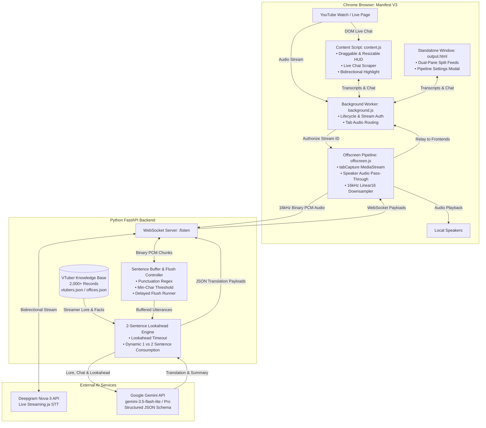

<div align="center">

# Project:KOTOBA

**Real-Time Japanese VTuber Stream Speech-to-Text & Context-Aware Translation System**

[](https://python.org)
[](https://fastapi.tiangolo.com)
[](https://developer.chrome.com/docs/extensions/mv3/)
[](https://deepgram.com)
[](https://ai.google.dev/)
[](LICENSE)

<p align="center">
  <a href="#overview">Overview</a> •
  <a href="#key-features">Key Features</a> •
  <a href="#system-architecture">System Architecture</a> •
  <a href="#getting-started">Getting Started</a> •
  <a href="#usage-guide">Usage Guide</a> •
  <a href="#pipeline-settings--configuration">Settings</a> •
  <a href="#api-reference">API Reference</a> •
  <a href="#project-structure">Project Structure</a> •
  <a href="#dataset--enrichment-tools">Dataset Tools</a>
</p>

</div>

---

## Overview

**Project KOTOBA** is an end-to-end real-time translation and stream comprehension suite engineered specifically for Japanese live streams and VTuber broadcasts. 

Standard speech-to-text models and generic machine translation struggle with Japanese live content due to heavy colloquialisms, fast speech cadence, specialized streamer slang, internet culture memes, and rapid streamer reactions to chat. Project KOTOBA solves this by pairing:

1. **Ultra-low latency streaming STT** via Deepgram Nova-3 using direct browser audio tab capture downsampled to 16kHz Linear16 PCM with uninterrupted speaker pass-through.
2. **A 2-Sentence Lookahead Buffering Engine** that resolves multi-clause sentence structures before translating.
3. **Culturally Grounded LLM Translation (Google Gemini)** conditioned on an in-memory database of **2,000+ VTubers**, live YouTube viewer chat context, and an evolving stream context summary.
4. **Interactive Dual-Feed User Interfaces**: A floating, draggable/resizable in-page HUD directly over YouTube and a standalone dual-pane pop-out window featuring bidirectional sentence hover-linking.

---

## Key Features

### 🎙️ Streaming Speech-to-Text with Speaker Pass-Through
- **Deepgram Nova-3 Engine**: Optimized for natural conversational Japanese with smart formatting, punctuate logic, endpointing, and voice activity detection (VAD).
- **Zero-Interruption Audio Pipeline**: Uses Chrome's Manifest V3 Offscreen Document API (`chrome.tabCapture`) to capture stream audio, downsamples Web Audio Float32 frames to 16kHz Linear16 PCM, and routes playback back to local speakers so you never lose stream audio.
- **Interim Speech Pulse**: Real-time interim transcript visualization displays words as they are being spoken before final sentence boundaries are committed.

### ⚡ Smart Sentence Buffering & 2-Sentence Lookahead
- **Smart Punctuation Splitting**: Recognizes Japanese and Western punctuation (`。`, `！`, `？`, `…`, `.`, `!`, `?`, `\n`) alongside character thresholds to prevent fragmented subtitles.
- **2-Sentence Forward Lookahead**: When a sentence boundary is reached, the buffer holds the target sentence and peers ahead into the subsequent sentence for up to a configurable timeout.
- **Dynamic Clause Cohesion**: Gemini dynamically determines whether consecutive utterances represent a single cohesive thought (translating both and advancing by 2 sentences) or independent ideas (translating 1 sentence).

### 🧠 Cultural Lore Grounding & Chat Reaction Attribution
- **2,000+ VTuber Knowledge Base**: Automatically resolves streamer identity from channel names and links. Injects agency affiliation (Hololive, Nijisanji, VSPO!, Neo-Porte, 774inc, etc.), character lore, and known personality traits into translation prompts.
- **Live Chat Reaction Attribution**: Constantly scrapes the active stream's live chat (from both main frame and embedded iframes). When a streamer reacts or replies to a viewer comment, Gemini identifies the exact comment index, quotes the author, and provides a translated chat attribution pill.
- **Running Stream Topic Summary**: Maintains a rolling narrative summary (up to 500–2,000 words) of the stream topic and ongoing conversations, giving the LLM long-range context for ambiguous pronouns and context shifts.

### 💻 Dual Interface Suite
- **In-Page Floating HUD**:
  - Injected directly into YouTube watch and live stream pages inside an isolated Shadow DOM.
  - Fully draggable, resizable from all edges, and automatically saves preferred screen coordinates and dimensions.
  - Can be toggled instantly via keyboard shortcut (`Alt+K`) or extension icon.
- **Standalone Dual-Pane Pop-Out Window (`output.html`)**:
  - Independent side-by-side workspace for multi-monitor setups.
  - Side-by-side split feeds: Live Japanese Transcriptions on the left, Contextual English Translations on the right.
  - Stream metadata banner with direct access to VTuber Profile Cards and one-click copy actions for both feeds.
- **Bidirectional Sentence Hover Highlighting**:
  - Hovering over any Japanese transcript instantly illuminates its corresponding English translation in gold (and vice versa), making cross-referencing effortless.

### 🎛️ Dynamic On-the-Fly Pipeline Settings
- In-app settings modal available in both the floating HUD and pop-out window.
- Customize Chat Context Count, Summary Word Count, Buffer Min Character Threshold, Flush Delays, and Lookahead Timeouts in real time without restarting the backend server.
- Optional custom API key overrides (Gemini and Deepgram) stored in local extension storage.

---

## System Architecture



---

## Getting Started

### Prerequisites

- **Python**: Version `3.10` or higher.
- **Browser**: Google Chrome, Microsoft Edge, Brave, or any Chromium-based browser supporting Manifest V3 and Offscreen Documents.
- **Deepgram API Key**: Free tier available at [Deepgram Console](https://console.deepgram.com/).
- **Google Gemini API Key**: Obtainable from [Google AI Studio](https://aistudio.google.com/).

---

### Step 1: Clone the Repository

```bash
git clone https://github.com/KYoru-0/Project-KOTOBA.git
cd Project-KOTOBA
```

---

### Step 2: Configure & Start Backend

1. Navigate to the `backend` directory:
   ```bash
   cd backend
   ```

2. Create and activate a Python virtual environment:
   ```bash
   # Windows (PowerShell)
   python -m venv venv
   .\venv\Scripts\Activate.ps1

   # Linux / macOS
   python3 -m venv venv
   source venv/bin/activate
   ```

3. Install required Python packages:
   ```bash
   pip install -r requirements.txt
   ```

4. Set up your environment variables:
   Create a `.env` file inside the `backend` directory (or workspace root):
   ```env
   DEEPGRAM_API_KEY=your_deepgram_api_key_here
   GEMINI_API_KEY=your_gemini_api_key_here
   GEMINI_MODEL=gemini-3.5-flash-lite
   ```

5. Launch the FastAPI backend server:
   ```bash
   python main.py
   ```
   > The server will start on `http://127.0.0.1:8000` with hot-reloading enabled. You can verify server status by opening `http://127.0.0.1:8000/` in your browser.

---

### Step 3: Install the Chrome Extension

1. Open your Chromium browser and go to `chrome://extensions/`.
2. Enable **Developer mode** using the toggle in the top-right corner.
3. Click the **Load unpacked** button in the top-left.
4. Select the [`frontend`](file:///k:/Works/Coding/projects/Project-KOTOBA/frontend) directory from this repository.
5. Project KOTOBA will appear in your extensions list. Pin it to your toolbar for quick access!

---

## Usage Guide

### Translating YouTube Live Streams

1. **Navigate to a Stream**: Open any Japanese stream or video on [YouTube](https://www.youtube.com).
2. **Open the Interface**:
   - **Floating In-Page HUD**: Press <kbd>Alt</kbd> + <kbd>K</kbd> or click the KOTOBA extension icon in your browser toolbar. A sleek floating overlay will appear over the video.
   - **Standalone Window**: Open [`output.html`](file:///k:/Works/Coding/projects/Project-KOTOBA/frontend/output.html) by clicking the extension popup or bookmarking `chrome-extension://<EXTENSION_ID>/output.html`.
3. **Authorize Tab Audio Capture**:
   - Click **Start Capture** (or press <kbd>Alt</kbd> + <kbd>K</kbd>). 
   - Browser tab audio will be captured and streamed to the backend while simultaneously passing through to your speakers.
4. **Enable Translation**:
   - Toggle the **Live Translation** switch in the HUD or pop-out window.
   - Watch real-time Japanese speech transcribed on the left and English translations appear on the right!

> [!TIP]
> **Bidirectional Sentence Inspection**: Hover your mouse over any English translation block. Its corresponding Japanese transcript sentence will instantly highlight in yellow/gold, helping language learners verify specific phrasing and vocabulary!

---

### Viewing VTuber Lore & Profile Cards

When watching an affiliated VTuber, Project KOTOBA automatically matches their channel with the Knowledge Base.

- In the floating HUD or pop-out header, click on the **Channel Name** or avatar.
- A **VTuber Profile Modal** opens with:
  - Official Japanese Kanji & English names.
  - Agency / Office (e.g. *Hololive Production*, *Nijisanji*, *VSPO!*).
  - Background Lore / Bio with expandable view.
  - Extracted Knowledge Base facts (debut dates, fanbase names, nicknames, character traits).

---

## Pipeline Settings & Configuration

Fine-tune transcription and translation performance directly from the **Pipeline Settings Modal** (click the gear icon ⚙️ in either interface):

| Parameter | Default | Range | Description |
| :--- | :---: | :---: | :--- |
| **Chat Context Count** | `20` | `1 – 50` | Number of recent viewer chat messages forwarded to Gemini to identify streamer reactions. |
| **Summary Max Words** | `500` | `50 – 2000` | Maximum word count for the rolling stream context and topic summary. |
| **Buffer Min Chars** | `30` | `5 – 200` | Minimum character length before the sentence buffer starts watching for punctuation. |
| **Buffer Flush Delay** | `3.0s` | `0.5 – 30.0s` | Time window to wait for additional speech before auto-flushing completed sentences. |
| **Lookahead Timeout** | `3.0s` | `0.0 – 30.0s` | Duration to wait for a 2nd sentence so Gemini can evaluate sentence cohesion. |
| **Custom Gemini Key** | *(Empty)* | String | Optional session override key; leaves server default when empty. |
| **Custom Deepgram Key**| *(Empty)* | String | Optional session override key; leaves server default when empty. |

---

## API Reference

The FastAPI backend exposes REST endpoints for health checks and entity lookups, plus a high-throughput WebSocket channel for live processing:

### REST Endpoints

#### `GET /`
Returns service readiness, active AI models, and database statistics.
```json
{
  "status": "online",
  "service": "Project KOTOBA",
  "ws_url": "ws://127.0.0.1:8000/listen",
  "deepgram_ready": true,
  "gemini_ready": true,
  "translation_model": "gemini-3.5-flash-lite",
  "vtuber_database_count": 2048
}
```

#### `GET /api/vtuber/lookup`
Query VTuber identity and metadata by channel name or YouTube URL.
- **Query Parameters**:
  - `channel_name` *(string, optional)*
  - `channel_link` *(string, optional)*
- **Response**:
  ```json
  {
    "found": true,
    "display_name": "Shirakami Fubuki - 白上フブキ",
    "vtuber_id": 12,
    "vtuber_names": {
      "english_name": "Shirakami Fubuki",
      "kanji_name": "白上フブキ"
    },
    "office_id": 1,
    "office_name": "ホロライブプロダクション (Hololive Production)",
    "facts": ["Fanbase: すこん部", "Species: Fox"],
    "channels": [{"channel_name": "Fox Ch. 白上フブキ", "channel_link": "https://www.youtube.com/..."}],
    "description": "White-haired fox girl who loves games and chatting..."
  }
  ```

---

### WebSocket Endpoint

#### `ws://127.0.0.1:8000/listen`
Accepts binary Linear16 PCM audio frames and live chat JSON messages; returns real-time transcripts, translation events, and context updates.

**Handshake Query Parameters**:
`language`, `model`, `title`, `channel`, `channel_link`, `translate`, `chat_context_count`, `summary_max_words`, `buffer_min_chars`, `buffer_flush_delay`, `lookahead_timeout`, `custom_gemini_key`, `custom_deepgram_key`.

**Key Outgoing Message Types to Frontend**:
- `status`: Connection handshake and matched VTuber entity details.
- `transcript`: Incremental interim (`is_final: false`) and committed final sentences (`is_final: true`).
- `translating`: Indicates which sentence has been locked into the translation pipeline.
- `translation`: Emitted when Gemini finishes translation. Contains translated text, sentence consumption count (`1` or `2`), attributed chat comment, and updated running summary.
- `error`: Diagnostic error messages.

---

## Project Structure

```text
Project-KOTOBA/
├── backend/
│   ├── main.py                  # FastAPI server, STT proxy, buffering & Gemini pipeline
│   ├── requirements.txt         # Python dependencies (FastAPI, websockets, google-genai, etc.)
│   └── .env                     # API keys and model configurations
├── frontend/
│   ├── manifest.json            # Manifest V3 extension configuration
│   ├── background.js            # Service worker managing audio capture & message relays
│   ├── offscreen.html / .js     # Audio capture, speaker pass-through & PCM downsampler
│   ├── content.js / .css        # Draggable YouTube floating HUD & live chat scraper
│   ├── output.html / .js / .css # Standalone dual-feed split screen window
│   └── icons/                   # Extension icons (16, 32, 48, 128, 256, 512 px)
├── dataset/
│   └── kb/
│       ├── vtubers.json         # 2,000+ VTuber database (names, channels, lore, quick facts)
│       └── offices.json         # Agency and talent office directory mapping
├── scripts/                     # Scraping, enrichment, and validation toolchain
│   ├── scrape_vtr.py            # UserLocal VTuber rankings scraper
│   ├── fetch_actual_names.py    # Kanji and English name extraction
│   ├── fetch_channel_links.py   # Official channel URL resolver
│   ├── fetch_description.py     # Channel biography and lore scraper
│   ├── fetch_facts.py           # Quick facts extraction
│   ├── fetch_fanbase_names.py   # Fanbase name resolution
│   ├── polish_vtuber_entries.py # Data normalizer and cleaning pipeline
│   └── verify_channel_links.py  # Link integrity verification tool
├── LICENSE                      # MIT License
└── README.md                    # Project documentation
```

---

## Dataset & Enrichment Tools

The [`scripts`](file:///k:/Works/Coding/projects/Project-KOTOBA/scripts) directory contains a modular suite of scraping and data-enrichment scripts used to build and maintain the VTuber Knowledge Base:

<details>
<summary><b>Click to expand dataset scripts and workflows</b></summary>
<br/>

1. **Rankings Scraper (`scrape_vtr.py`)**:
   Uses Selenium to crawl VTuber ranking pages on UserLocal, collecting agency affiliations, channel names, and subscriber counts.
2. **Channel Resolution (`fetch_channel_links.py` & `verify_channel_links.py`)**:
   Scrapes and validates primary YouTube channel URLs for each VTuber record.
3. **Lore & Facts Extraction (`fetch_description.py` & `fetch_facts.py`)**:
   Pulls official channel descriptions, debut information, and personality traits.
4. **Fanbase Name Extractor (`fetch_fanbase_names.py`)**:
   Enriches records with community names (e.g., *すこん部*, *35P*, *宝鐘の一味*) so the LLM recognizes streamer references to their chat.
5. **Entry Polisher (`polish_vtuber_entries.py`)**:
   Normalizes Unicode whitespace, standardizes JSON structures, and removes duplicate entries.

</details>

---

## Keyboard Shortcuts & Quick Reference

| Shortcut / Action | Scope | Description |
| :--- | :---: | :--- |
| <kbd>Alt</kbd> + <kbd>K</kbd> | Global / YouTube | Toggle the KOTOBA in-page HUD & request tab audio capture. |
| **Drag Header Bar** | In-Page HUD | Move floating HUD to any preferred position on screen. |
| **Drag Edges / Corners** | In-Page HUD | Resize HUD width and height dynamically. |
| **Hover Transcript / Translation** | Dual Feeds | Bidirectional sentence highlighting (links JP to EN). |
| **Click Channel Name** | Banner / HUD | Opens VTuber Profile Modal with lore, agency, and facts. |
| **Copy Icons (📋)** | Pane Headers | Copy entire Japanese transcript or English translations to clipboard. |

---

## Troubleshooting & FAQs

<details>
<summary><b>Audio capture shows: <i>"Click the KOTOBA toolbar icon once to authorize tab audio"</i></b></summary>
<br/>
Chrome's <code>activeTab</code> security policy requires a single user gesture before an extension can capture tab media. Click the extension icon in your browser toolbar once, or press <kbd>Alt</kbd> + <kbd>K</kbd> while on the YouTube tab.
</details>

<details>
<summary><b>No translations appear, but Japanese transcripts are working</b></summary>
<br/>
Check the following:
1. Ensure the <b>Live Translation</b> switch is turned <b>ON</b>.
2. Verify that <code>GEMINI_API_KEY</code> is correctly set in <code>backend/.env</code> or entered in the <b>Pipeline Settings</b> modal.
3. Check backend console logs to ensure Gemini API quota has not been exceeded.
</details>

<details>
<summary><b>Audio is silent after starting capture</b></summary>
<br/>
KOTOBA uses an offscreen document with speaker pass-through to ensure tab audio continues playing through your default audio output device. Ensure your browser tab is not muted and that the offscreen document has audio playback permission.
</details>

---

## License

This project is licensed under the [MIT License](LICENSE).
