<div align="center">

# Project:KOTOBA

**Real-Time Japanese VTuber Stream Speech-to-Text & Context-Aware Translation System**

[](https://python.org)
[](https://fastapi.tiangolo.com)
[](https://developer.chrome.com/docs/extensions/mv3/)
[](https://deepgram.com)
[](https://ai.google.dev/)
[](LICENSE)

<p align="center">
  <a href="#overview">Overview</a> •
  <a href="#key-features">Key Features</a> •
  <a href="#system-architecture">System Architecture</a> •
  <a href="#getting-started">Getting Started</a> •
  <a href="#usage-guide">Usage Guide</a> •
  <a href="#pipeline-settings--configuration">Settings</a> •
  <a href="#api-reference">API Reference</a> •
  <a href="#project-structure">Project Structure</a> •
  <a href="#dataset--enrichment-tools">Dataset Tools</a>
</p>

</div>

---

## Overview

**Project KOTOBA** is a real-time speech recognition and translation system designed specifically for Japanese live streams and VTubers.

Standard machine translation models frequently struggle with live Japanese broadcasts due to rapid delivery, casual grammar, stream-specific slang, and spontaneous reactions to viewer chat. Project KOTOBA addresses this with:

1. **Low-latency streaming STT** using Deepgram Nova-3 over direct browser tab audio capture, downsampled to 16kHz Linear16 PCM with continuous local audio pass-through.
2. **A 2-sentence lookahead buffer** that evaluates multi-clause sentence continuity before sending requests to the translation model.
3. **Context-aware translation via Google Gemini**, grounded in an in-memory database of over 2,000 VTubers, recent live chat messages, and an evolving stream context summary.
4. **Dual user interfaces**: An in-page draggable and resizable HUD overlaid directly on YouTube, alongside a dedicated standalone split-view window with synchronized bidirectional sentence highlighting.

---

## Key Features

### Streaming Speech-to-Text with Speaker Pass-Through
- **Deepgram Nova-3 Engine**: Configured for conversational Japanese with smart formatting, punctuation handling, endpointing, and voice activity detection (VAD).
- **Audio Capture Pipeline**: Captures tab audio via Chrome's Offscreen Document API (`chrome.tabCapture`), downsamples Float32 frames to 16kHz Linear16 PCM, and routes output to local speakers without muting the stream.
- **Interim Transcripts**: Real-time interim feedback displays words as they are recognized before sentences are finalized.

### Sentence Buffering and 2-Sentence Lookahead
- **Punctuation-Based Splitting**: Recognizes Japanese and Western sentence terminators (`。`, `！`, `？`, `…`, `.`, `!`, `?`, `\n`) combined with character-length thresholds to avoid short, fragmented subtitles.
- **2-Sentence Lookahead**: When a sentence boundary is detected, the buffer retains the primary sentence and waits up to a configurable timeout for the next utterance.
- **Dynamic Clause Merging**: Allows the translation model to decide whether consecutive utterances form a single coherent thought (consuming both) or should be translated individually.

### Context Grounding and Chat Attribution
- **VTuber Knowledge Base**: Matches channel names and URLs against an in-memory database of over 2,000 VTuber records, providing agency affiliations (Hololive, Nijisanji, VSPO!, Neo-Porte, 774inc, and independents), character lore, and known personality traits to the model.
- **Live Chat Reaction Matching**: Collects recent chat messages from the top frame and chat iframes. When a streamer responds to a comment, the translation pipeline identifies the comment, displays the author, and provides an English translation of the chat message.
- **Rolling Stream Summary**: Maintains a running narrative summary of recent topics to preserve context across topic shifts.

### Dual Interface Options
- **In-Page Floating HUD**:
  - Embedded directly into YouTube watch and live pages inside an isolated Shadow DOM.
  - Draggable and resizable from all edges, saving position and size preferences to local extension storage.
  - Toggleable via keyboard shortcut (`Alt+K`) or the browser action icon.
- **Standalone Dual-Pane Window (`output.html`)**:
  - Dedicated two-column layout for multi-monitor setups.
  - Transcriptions on the left, translations on the right.
  - Includes channel metadata, quick copy buttons, and status indicators.
- **Bidirectional Sentence Highlighting**:
  - Hovering over a Japanese transcript highlights the corresponding English translation block in gold, and vice versa.

### In-App Pipeline Configuration
- A settings modal available directly in both the HUD and pop-out window.
- Adjust chat context window size, summary length limits, buffer thresholds, flush intervals, and lookahead timeouts on the fly without restarting the backend.
- Supports optional per-session API key overrides for Gemini and Deepgram.

---

## System Architecture

```mermaid
flowchart TD
    subgraph Browser ["Chrome Browser: Manifest V3"]
        YT["YouTube Watch / Live Page"]
        CS["Content Script: content.js<br/>• Draggable & Resizable HUD<br/>• Live Chat Scraper<br/>• Bidirectional Highlight"]
        BG["Background Worker: background.js<br/>• Lifecycle & Stream Auth<br/>• Tab Audio Routing"]
        OFF["Offscreen Pipeline: offscreen.js<br/>• tabCapture MediaStream<br/>• Speaker Audio Pass-Through<br/>• 16kHz Linear16 Downsampler"]
        OUT["Standalone Window: output.html<br/>• Dual-Pane Split Feeds<br/>• Pipeline Settings Modal"]
        
        YT -->|Audio Stream| BG
        YT -->|DOM Live Chat| CS
        BG -->|Authorize Stream ID| OFF
        OFF -->|Audio Playback| SPK["Local Speakers"]
        CS <-->|Transcripts & Chat| BG
        OUT <-->|Transcripts & Chat| BG
    end

    subgraph Backend ["Python FastAPI Backend"]
        WS["WebSocket Server: /listen"]
        KB[("VTuber Knowledge Base<br/>2,000+ Records<br/>vtubers.json / offices.json")]
        BUF["Sentence Buffer & Flush Controller<br/>• Punctuation Regex<br/>• Min-Char Threshold<br/>• Delayed Flush Runner"]
        LOOK["2-Sentence Lookahead Engine<br/>• Lookahead Timeout<br/>• Dynamic 1 vs 2 Sentence Consumption"]
        
        WS <-->|Binary PCM Chunks| BUF
        KB -->|Streamer Lore & Facts| LOOK
        BUF -->|Buffered Utterances| LOOK
    end

    subgraph Cloud ["External AI Services"]
        DG["Deepgram Nova-3 API<br/>Live Streaming ja STT"]
        GEMINI["Google Gemini API<br/>gemini-3.5-flash-lite / Pro<br/>Structured JSON Schema"]
    end

    OFF -->|16kHz Binary PCM Audio| WS
    WS <-->|Bidirectional Stream| DG
    LOOK -->|Lore, Chat & Lookahead| GEMINI
    GEMINI -->|Translation & Summary| LOOK
    LOOK -->|JSON Translation Payloads| WS
    WS -->|WebSocket Payloads| OFF
    OFF -->|Relay to Frontends| BG
```



---

## Getting Started

### Prerequisites

- **Python**: Version `3.10` or higher.
- **Browser**: Google Chrome, Microsoft Edge, Brave, or any Chromium-based browser supporting Manifest V3 and Offscreen Documents.
- **Deepgram API Key**: Available from the [Deepgram Console](https://console.deepgram.com/).
- **Google Gemini API Key**: Available from [Google AI Studio](https://aistudio.google.com/).

---

### Step 1: Clone the Repository

```bash
git clone https://github.com/KYoru-0/Project-KOTOBA.git
cd Project-KOTOBA
```

---

### Step 2: Configure and Start the Backend

1. Navigate to the `backend` directory:
   ```bash
   cd backend
   ```

2. Create and activate a Python virtual environment:
   ```bash
   # Windows (PowerShell)
   python -m venv venv
   .\venv\Scripts\Activate.ps1

   # Linux / macOS
   python3 -m venv venv
   source venv/bin/activate
   ```

3. Install required Python packages:
   ```bash
   pip install -r requirements.txt
   ```

4. Configure environment variables:
   Create a `.env` file inside the `backend` directory:
   ```env
   DEEPGRAM_API_KEY=your_deepgram_api_key_here
   GEMINI_API_KEY=your_gemini_api_key_here
   GEMINI_MODEL=gemini-3.5-flash-lite
   ```

5. Start the FastAPI server:
   ```bash
   python main.py
   ```
   > The server starts on `http://127.0.0.1:8000`. You can confirm status by visiting `http://127.0.0.1:8000/` in your browser.

---

### Step 3: Install the Chrome Extension

1. Open your Chromium browser and navigate to `chrome://extensions/`.
2. Enable **Developer mode** via the toggle in the top-right corner.
3. Click **Load unpacked** in the top-left corner.
4. Select the [`frontend`](file:///k:/Works/Coding/projects/Project-KOTOBA/frontend) folder from this repository.
5. Project KOTOBA will appear in your extension list. Pin it to your toolbar for easy access.

---

## Usage Guide

### Translating YouTube Live Streams

1. **Open a Stream**: Navigate to any Japanese stream or video on [YouTube](https://www.youtube.com).
2. **Open the Interface**:
   - **Floating In-Page HUD**: Press <kbd>Alt</kbd> + <kbd>K</kbd> or click the KOTOBA toolbar icon. The floating overlay will appear over the video.
   - **Standalone Window**: Open [`output.html`](file:///k:/Works/Coding/projects/Project-KOTOBA/frontend/output.html) by clicking the extension popup or navigating to `chrome-extension://<EXTENSION_ID>/output.html`.
3. **Authorize Audio Capture**:
   - Click **Start Capture** (or press <kbd>Alt</kbd> + <kbd>K</kbd>).
   - Audio is captured and sent to the backend while continuing playback to your local output device.
4. **Enable Translation**:
   - Turn on the **Live Translation** switch in the HUD or pop-out window.
   - Live transcriptions appear in the left pane and translated subtitles appear on the right.

> [!TIP]
> **Bidirectional Sentence Highlighting**: Hovering over an English translation block highlights its corresponding Japanese transcript in gold, making it straightforward to cross-reference specific vocabulary and phrasing.

---

### VTuber Lore and Profile Cards

When watching an affiliated VTuber, Project KOTOBA attempts to match the channel against the internal Knowledge Base.

- In the HUD or pop-out header, click on the **Channel Name** or avatar.
- The **VTuber Profile Modal** opens with:
  - Official Japanese Kanji and English names.
  - Agency / Office affiliation (e.g. *Hololive Production*, *Nijisanji*, *VSPO!*).
  - Biography and background lore with an expandable view.
  - Quick facts (debut date, fanbase name, nicknames, character traits).

---

## Pipeline Settings & Configuration

Parameters can be adjusted directly from the **Pipeline Settings Modal** (click the gear icon in either interface):

| Parameter | Default | Range | Description |
| :--- | :---: | :---: | :--- |
| **Chat Context Count** | `20` | `1 – 50` | Number of recent viewer chat comments forwarded to Gemini to detect streamer reactions. |
| **Summary Max Words** | `500` | `50 – 2000` | Word limit for the rolling stream topic and context summary. |
| **Buffer Min Chars** | `30` | `5 – 200` | Minimum character length before the sentence buffer begins checking for punctuation. |
| **Buffer Flush Delay** | `3.0s` | `0.5 – 30.0s` | Delay window to wait for continued speech before auto-flushing completed sentences. |
| **Lookahead Timeout** | `3.0s` | `0.0 – 30.0s` | Maximum wait time for a second sentence to evaluate clause cohesion. |
| **Custom Gemini Key** | *(Empty)* | String | Optional session override key; uses server environment variable when blank. |
| **Custom Deepgram Key**| *(Empty)* | String | Optional session override key; uses server environment variable when blank. |

---

## API Reference

The FastAPI backend exposes REST endpoints for health checks and entity lookups, alongside a WebSocket route for real-time audio and text streaming:

### REST Endpoints

#### `GET /`
Returns backend health status, active models, and database statistics.
```json
{
  "status": "online",
  "service": "Project KOTOBA",
  "ws_url": "ws://127.0.0.1:8000/listen",
  "deepgram_ready": true,
  "gemini_ready": true,
  "translation_model": "gemini-3.5-flash-lite",
  "vtuber_database_count": 2048
}
```

#### `GET /api/vtuber/lookup`
Query VTuber identity and metadata by channel name or YouTube URL.
- **Query Parameters**:
  - `channel_name` *(string, optional)*
  - `channel_link` *(string, optional)*
- **Response**:
  ```json
  {
    "found": true,
    "display_name": "Shirakami Fubuki - 白上フブキ",
    "vtuber_id": 12,
    "vtuber_names": {
      "english_name": "Shirakami Fubuki",
      "kanji_name": "白上フブキ"
    },
    "office_id": 1,
    "office_name": "ホロライブプロダクション (Hololive Production)",
    "facts": ["Fanbase: すこん部", "Species: Fox"],
    "channels": [{"channel_name": "Fox Ch. 白上フブキ", "channel_link": "https://www.youtube.com/..."}],
    "description": "White-haired fox girl who loves games and chatting..."
  }
  ```

---

### WebSocket Endpoint

#### `ws://127.0.0.1:8000/listen`
Receives binary Linear16 PCM audio chunks and live chat JSON payloads; emits real-time transcripts, translation events, and context updates.

**Query Parameters**:
`language`, `model`, `title`, `channel`, `channel_link`, `translate`, `chat_context_count`, `summary_max_words`, `buffer_min_chars`, `buffer_flush_delay`, `lookahead_timeout`, `custom_gemini_key`, `custom_deepgram_key`.

**Key Outgoing Message Types**:
- `status`: Handshake confirmation and matched VTuber entity details.
- `transcript`: Incremental interim (`is_final: false`) and committed final sentences (`is_final: true`).
- `translating`: Indicates which sentence is currently being processed by the translation model.
- `translation`: Emitted when translation completes. Contains translated text, sentence consumption count (`1` or `2`), attributed chat comment, and updated running summary.
- `error`: Error details and connection diagnostics.

---

## Project Structure

```text
Project-KOTOBA/
├── backend/
│   ├── main.py                  # FastAPI server, STT proxy, buffering & Gemini pipeline
│   ├── requirements.txt         # Python dependencies (FastAPI, websockets, google-genai, etc.)
│   └── .env                     # API keys and model configurations
├── frontend/
│   ├── manifest.json            # Manifest V3 extension configuration
│   ├── background.js            # Service worker managing audio capture & message relays
│   ├── offscreen.html / .js     # Audio capture, speaker pass-through & PCM downsampler
│   ├── content.js / .css        # Draggable YouTube floating HUD & live chat scraper
│   ├── output.html / .js / .css # Standalone dual-feed split screen window
│   └── icons/                   # Extension icons (16, 32, 48, 128, 256, 512 px)
├── dataset/
│   └── kb/
│       ├── vtubers.json         # 2,000+ VTuber database (names, channels, lore, quick facts)
│       └── offices.json         # Agency and talent office directory mapping
├── scripts/                     # Scraping, enrichment, and validation toolchain
│   ├── scrape_vtr.py            # UserLocal VTuber rankings scraper
│   ├── fetch_actual_names.py    # Kanji and English name extraction
│   ├── fetch_channel_links.py   # Official channel URL resolver
│   ├── fetch_description.py     # Channel biography and lore scraper
│   ├── fetch_facts.py           # Quick facts extraction
│   ├── fetch_fanbase_names.py   # Fanbase name resolution
│   ├── polish_vtuber_entries.py # Data normalizer and cleaning pipeline
│   └── verify_channel_links.py  # Link integrity verification tool
├── LICENSE                      # MIT License
└── README.md                    # Project documentation
```

---

## Dataset & Enrichment Tools

The [`scripts`](file:///k:/Works/Coding/projects/Project-KOTOBA/scripts) directory contains modular scraping and data enrichment tools used to maintain the VTuber Knowledge Base:

<details>
<summary><b>Click to expand dataset scripts and workflows</b></summary>
<br/>

1. **Rankings Scraper (`scrape_vtr.py`)**:
   Uses Selenium to crawl VTuber ranking pages on UserLocal, collecting agency affiliations, channel names, and subscriber counts.
2. **Channel Resolution (`fetch_channel_links.py` & `verify_channel_links.py`)**:
   Scrapes and validates primary YouTube channel URLs for each VTuber record.
3. **Lore & Facts Extraction (`fetch_description.py` & `fetch_facts.py`)**:
   Retrieves official channel descriptions, debut information, and personality traits.
4. **Fanbase Name Extractor (`fetch_fanbase_names.py`)**:
   Enriches records with community names (e.g., *すこん部*, *35P*, *宝鐘の一味*) so the model recognizes streamer references to their chat.
5. **Entry Polisher (`polish_vtuber_entries.py`)**:
   Normalizes Unicode whitespace, standardizes JSON schemas, and eliminates duplicates.

</details>

---

## Keyboard Shortcuts and Controls

| Shortcut / Control | Scope | Description |
| :--- | :---: | :--- |
| <kbd>Alt</kbd> + <kbd>K</kbd> | Global / YouTube | Toggle the KOTOBA in-page HUD and request tab audio capture. |
| **Drag Header Bar** | In-Page HUD | Move floating HUD to any location on the screen. |
| **Drag Edges / Corners** | In-Page HUD | Dynamically resize HUD width and height. |
| **Hover Transcript / Translation** | Dual Feeds | Bidirectional sentence highlighting between Japanese and English. |
| **Click Channel Name** | Banner / HUD | Opens VTuber Profile Modal with lore, agency details, and quick facts. |
| **Copy Buttons** | Pane Headers | Copy Japanese transcripts or English translations to clipboard. |

---

## Troubleshooting & FAQs

<details>
<summary><b>Audio capture shows: <i>"Click the KOTOBA toolbar icon once to authorize tab audio"</i></b></summary>
<br/>
Chrome's <code>activeTab</code> security policy requires a user gesture before an extension can capture tab media. Click the extension icon in your browser toolbar once, or press <kbd>Alt</kbd> + <kbd>K</kbd> while on the YouTube tab.
</details>

<details>
<summary><b>No translations appear, but Japanese transcripts are working</b></summary>
<br/>
Check the following:
1. Ensure the <b>Live Translation</b> toggle is turned <b>ON</b>.
2. Verify that <code>GEMINI_API_KEY</code> is correctly configured in <code>backend/.env</code> or provided via the <b>Pipeline Settings</b> modal.
3. Check backend console logs to ensure Gemini API quotas have not been exceeded.
</details>

<details>
<summary><b>Audio is silent after starting capture</b></summary>
<br/>
KOTOBA uses an offscreen document with speaker pass-through to ensure tab audio continues playing through your default audio output device. Ensure the browser tab is not muted and that the offscreen document has audio playback permissions.
</details>

---

## License

This project is licensed under the [MIT License](LICENSE).
